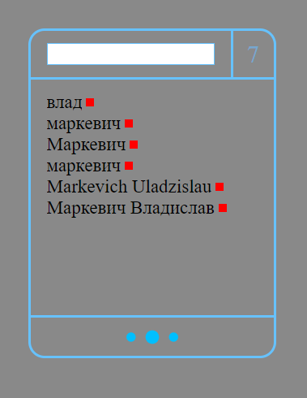

# LIST

To add an item to the list, you need to enter data in the input field at the top and press "Enter"

To edit an existing item, you need to click on it in the list

To delete an item, you need to click on the red square

To increase the number of displayed items in the list, you need to correct the number in the upper right

